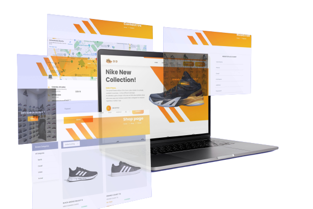

# 👟 DD-Footwear - Ecommerce Footwear Store

Welcome to DD-Footwear, your go-to destination for purchasing desired footwear online.

## 🥿 Website Overview

DD-Footwear offers an engaging experience:
- **User Access:** 👩‍💻 Explore and purchase desired footwear effortlessly.
- **Admin Control:** 👨‍💼 Perform CRUD operations for efficient inventory management.

## 💻 Technology Stack

- **Development Framework:** .Net using C# and ASP
- **Architecture:** Service Oriented Architecture (SOA)

## 🌐 Website Features

1. **For Users:**
   - Browse and purchase desired footwear with ease.
   - Explore a wide range of available shoes conveniently.

2. **For Admins:**
   - Manage inventory efficiently with CRUD functionalities.

## 🚀 Development Details

- **Dynamic & Responsive:** Built with a focus on dynamic content and responsive design.
- **SOA Implementation:** Leveraging Service Oriented Architecture for robust functionality.

Thank you for exploring DD-Footwear! 👞🛍️
